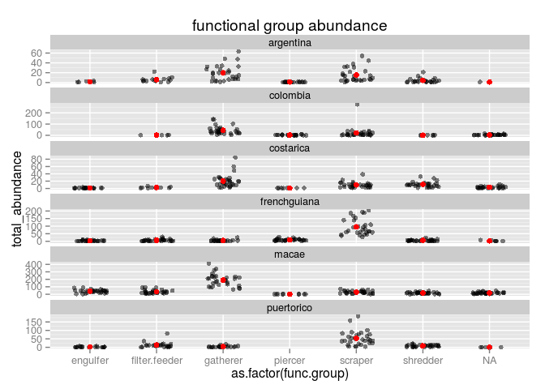
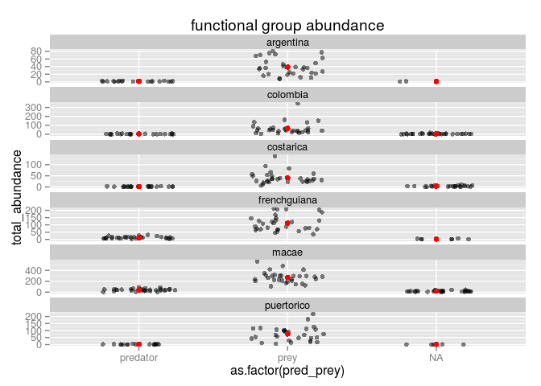

Introduction
============

This is an R package for the bromeliad working group rainfall
experiment. Our intention is to create a set of tools that facilitate
all steps of the process:

-   loading data into R
-   combining data from different replicates
-   performing calculations

At present the package allows each group of authors to obtain the
datasets they will need to **begin** their analysis.

Please [open an issue](https://github.com/SrivastavaLab/bwgtools/issues)
if there is a feature you would like to see, or if you discover an error
or bug!

Installation
============

`bwgtools` can be installed directly from Github using devtools:

    install.packages("devtools") # if you don't have devtools
    library(devtools)
    install_github("SrivastavaLab/bwgtools", dependencies = TRUE)

Accessing Dropbox
=================

`bwgtools` uses [rdrop2](https://github.com/karthik/rdrop2) to access
your Dropbox account, then uses
[readxl](https://github.com/hadley/readxl) to download the data and read
it directly into R. When you first run `library(bwgtools)` you will see
the following message:

    library(bwgtools)

    ## Welcome to the bwg R package! in order to obtain data from the BWG dropbox folder, you need to authorize R to access your dropbox. run the following commands:
    ##   library(rdrop2)
    ##   drop_auth(cache = FALSE)
    ## Then enter your username and password. This should only need to be done when downloading the data.

Important Note: Protect your account!
-------------------------------------

**In Dropbox:** by default, `drop_auth()` saves your Dropbox login to a
file called `.httr-oauth`. Of course, we don't want this shared with
everyone in our Dropbox folder, as they would then be able to access
your personal Dropbox account! Therefore, we set `cache=FALSE`. This
will require us to re-authenticate every time we want to download fresh
data. This should be a quick and painless process, especially if you are
already logged in on your computer. However, bwgtools should work from
any computer connected to the internet, provided that you have your
Dropbox username and password.

**Working outside of Dropbox:** running `drop_acc()` or `drop_auth()`
will create a file called `.httr-oauth` in your directory, which will
contain your login credentials for Dropbox. **Remember to add this file
to your .gitignore if you are using git**. For more information, see
`?rdrop2::drop_auth`.

Reading a single sheet
======================

Once you have authenticated with Dropbox, you can read data directly
into R. To obtain a single tab (for example, the "leaf.waterdepths" tab)
for a single site (for example, Macae), use the function
`read_sheet_site`:

    macae <- read_site_sheet("Macae", "leaf.waterdepths")

    ## [1] "fetching from dropbox"

    ## 
    ##  /tmp/RtmpqhCGdH/Drought_data_Macae.xlsx on disk 311.868 KB

    knitr::kable(head(macae))

<table>
<thead>
<tr class="header">
<th align="left">site</th>
<th align="left">trt.name</th>
<th align="left">bromeliad.id</th>
<th align="left">date</th>
<th align="right">depth.centre.measure.first</th>
<th align="right">depth.leafa.measure.first</th>
<th align="right">depth.leafb.measure.first</th>
<th align="right">depth.centre.water.first</th>
<th align="right">depth.leafa.water.first</th>
<th align="right">depth.leafb.water.first</th>
</tr>
</thead>
<tbody>
<tr class="odd">
<td align="left">macae</td>
<td align="left">mu0.1k0.5</td>
<td align="left">B24</td>
<td align="left">2013-03-15</td>
<td align="right">NA</td>
<td align="right">NA</td>
<td align="right">NA</td>
<td align="right">147.0</td>
<td align="right">0.0</td>
<td align="right">60.0</td>
</tr>
<tr class="even">
<td align="left">macae</td>
<td align="left">mu0.1k0.5</td>
<td align="left">B24</td>
<td align="left">2013-03-16</td>
<td align="right">NA</td>
<td align="right">NA</td>
<td align="right">NA</td>
<td align="right">133.3</td>
<td align="right">31.6</td>
<td align="right">53.3</td>
</tr>
<tr class="odd">
<td align="left">macae</td>
<td align="left">mu0.1k0.5</td>
<td align="left">B24</td>
<td align="left">2013-03-17</td>
<td align="right">NA</td>
<td align="right">NA</td>
<td align="right">NA</td>
<td align="right">111.0</td>
<td align="right">5.3</td>
<td align="right">65.1</td>
</tr>
<tr class="even">
<td align="left">macae</td>
<td align="left">mu0.1k0.5</td>
<td align="left">B24</td>
<td align="left">2013-03-18</td>
<td align="right">NA</td>
<td align="right">NA</td>
<td align="right">NA</td>
<td align="right">107.2</td>
<td align="right">12.6</td>
<td align="right">67.2</td>
</tr>
<tr class="odd">
<td align="left">macae</td>
<td align="left">mu0.1k0.5</td>
<td align="left">B24</td>
<td align="left">2013-03-19</td>
<td align="right">NA</td>
<td align="right">NA</td>
<td align="right">NA</td>
<td align="right">104.8</td>
<td align="right">21.5</td>
<td align="right">53.4</td>
</tr>
<tr class="even">
<td align="left">macae</td>
<td align="left">mu0.1k0.5</td>
<td align="left">B24</td>
<td align="left">2013-03-20</td>
<td align="right">NA</td>
<td align="right">NA</td>
<td align="right">NA</td>
<td align="right">94.3</td>
<td align="right">20.2</td>
<td align="right">74.3</td>
</tr>
</tbody>
</table>

Working offline
---------------

The first argument to this function can either be the name of a site
(`"Macae"`, in the example above), **or** a path to the location of the
file on your hard drive. For example, on my (Andrew's) computer, the
path to Dropbox is:

    ../../../Dropbox

So I could read in my local copy of the data like this:

    macae <- read_site_sheet("../../../Dropbox/BWG Drought Experiment/raw data/Drought_data_Macae.xlsx", "leaf.waterdepths")

    ## you downloaded that file already! reading from disk

This is an example of a *relative path*; the symbol `..` means "one
directory above my current location". This is the relative path *from*
the directory where I am developing `bwgtools` *to* the directory where
the Macae data is stored, on my machine. There is more information about
relative paths
[here](http://swcarpentry.github.io/shell-novice/01-filedir.html).

To save typing, I've made a convenience function that fills in the
relative path for you. It requires the name of the sheet you want, and
the path from your current working directory to the full Dropbox folder:

    macae <- read_site_sheet(offline("Macae", default.path = "../../../Dropbox/"), "leaf.waterdepths")

    ## you downloaded that file already! reading from disk

    ## or, equivalently:
    library(magrittr)

    macae <- "Macae" %>% 
      offline(default.path = "../../../Dropbox/") %>%  ## use your own path
      read_site_sheet(sheetname = "leaf.waterdepths")

    ## you downloaded that file already! reading from disk

**PLEASE NOTE**: the major *disadvantage* of this approach is that your
local version of the data may be behind the official version on the
Dropbox website. To be safe, use the online version whenever you can.

Reading multiple sheets
=======================

For all our analyses, we will need to collect data from all sites. ; we
can also load and combine the same tab across all sites, with a single
function: `combine_tab()`. This function has two arguments: the first is
a vector of all the site names (as spelt in the file names in the
`raw data/` folder). The second is the name of the sheet to read (as
above). For example, to obtain the "site.info" tab for all sites, use
the following command:

    library(dplyr)
    library(knitr)
    c("Argentina", "French_Guiana", "Colombia",
      "Macae", "PuertoRico","CostaRica") %>%
      combine_tab(sheetname = "site.info") %>% 
      head %>% 
      kable

[1] "fetching from dropbox" [1] "fetching from dropbox" [1] "fetching
from dropbox" [1] "fetching from dropbox" [1] "fetching from dropbox"

<table>
<thead>
<tr class="header">
<th align="left">site.name</th>
<th align="right">combined.correction.factor</th>
<th align="right">mean.catchment.area</th>
<th align="right">effective.catchment.area</th>
<th align="left">identity.bromeliad.species</th>
<th align="right">natural.detrital.species.1.15n</th>
<th align="right">natural.detrital.species.2.15n</th>
<th align="right">fertilized.detrital.species.1.15n</th>
<th align="right">fertilized.detrital.species.2.15n</th>
<th align="right">natural.bromeliad.15n</th>
<th align="right">natural.bromeliad.percentn</th>
<th align="right">natural.bromeliad.percentc</th>
<th align="left">identity.15n.detrital.species.1</th>
<th align="left">identity.15n.detrital.species.2</th>
<th align="left">identity.leafpack.species.1</th>
<th align="left">identity.leafpack.species.2</th>
<th align="left">start.water.addition</th>
<th align="left">last.day.sample</th>
<th align="left">ibutton.frequency</th>
</tr>
</thead>
<tbody>
<tr class="odd">
<td align="left">argentina</td>
<td align="right">0.3570</td>
<td align="right">1039.533</td>
<td align="right">371.1133</td>
<td align="left">aechmea.distichantha</td>
<td align="right">NA</td>
<td align="right">NA</td>
<td align="right">NA</td>
<td align="right">NA</td>
<td align="right">NA</td>
<td align="right">NA</td>
<td align="right">NA</td>
<td align="left">NA</td>
<td align="left">NA</td>
<td align="left">myrcianthes.cisplatensis</td>
<td align="left">NA</td>
<td align="left">2013-10-10</td>
<td align="left">2013-12-16</td>
<td align="left">hour</td>
</tr>
<tr class="even">
<td align="left">frenchguiana</td>
<td align="right">0.3800</td>
<td align="right">1060.000</td>
<td align="right">402.8000</td>
<td align="left">vriesea.splendens</td>
<td align="right">0.460000</td>
<td align="right">NA</td>
<td align="right">1148.70000</td>
<td align="right">NA</td>
<td align="right">1.860000</td>
<td align="right">1.0400000</td>
<td align="right">50.62000</td>
<td align="left">Melastomataceae</td>
<td align="left">NA</td>
<td align="left">duguetia.pycnastera</td>
<td align="left">eperua.grandiflora</td>
<td align="left">2012-11-01</td>
<td align="left">2013-01-10</td>
<td align="left">hour</td>
</tr>
<tr class="odd">
<td align="left">colombia</td>
<td align="right">0.3613</td>
<td align="right">2297.898</td>
<td align="right">830.2305</td>
<td align="left">Guzmania.spp</td>
<td align="right">-1.093333</td>
<td align="right">-1.296667</td>
<td align="right">0.36653</td>
<td align="right">0.36701</td>
<td align="right">-3.768889</td>
<td align="right">0.5749411</td>
<td align="right">45.09735</td>
<td align="left">alnus.acuminata</td>
<td align="left">melastomatacea</td>
<td align="left">alnus.acuminata</td>
<td align="left">melastomatacea</td>
<td align="left">2013-04-03</td>
<td align="left">2013-06-09</td>
<td align="left">hour</td>
</tr>
<tr class="even">
<td align="left">macae</td>
<td align="right">0.2700</td>
<td align="right">1218.000</td>
<td align="right">328.8600</td>
<td align="left">neoregelia.cruenta</td>
<td align="right">NA</td>
<td align="right">NA</td>
<td align="right">6984.80000</td>
<td align="right">NA</td>
<td align="right">NA</td>
<td align="right">NA</td>
<td align="right">NA</td>
<td align="left">eugenia.uniflora</td>
<td align="left">NA</td>
<td align="left">eugenia.uniflora</td>
<td align="left">NA</td>
<td align="left">2013-03-15</td>
<td align="left">2013-05-21</td>
<td align="left">hour</td>
</tr>
<tr class="odd">
<td align="left">puertorico</td>
<td align="right">0.3877</td>
<td align="right">1110.140</td>
<td align="right">43.4013</td>
<td align="left">guzmania</td>
<td align="right">NA</td>
<td align="right">NA</td>
<td align="right">NA</td>
<td align="right">NA</td>
<td align="right">-2.447934</td>
<td align="right">1.0181657</td>
<td align="right">48.83634</td>
<td align="left">melostomataceae</td>
<td align="left">NA</td>
<td align="left">dacryodes.excelsa</td>
<td align="left">dendropanax.arboreus</td>
<td align="left">2014-03-23</td>
<td align="left">2014-05-29</td>
<td align="left">hour</td>
</tr>
<tr class="even">
<td align="left">costarica</td>
<td align="right">0.3970</td>
<td align="right">1622.000</td>
<td align="right">643.9340</td>
<td align="left">guzmania.spp</td>
<td align="right">NA</td>
<td align="right">NA</td>
<td align="right">NA</td>
<td align="right">NA</td>
<td align="right">-1.660000</td>
<td align="right">0.4500000</td>
<td align="right">43.78000</td>
<td align="left">conostegia.xalapensis</td>
<td align="left">NA</td>
<td align="left">conostegia.xalapensis</td>
<td align="left">NA</td>
<td align="left">2012-10-06</td>
<td align="left">2012-12-14</td>
<td align="left">hour</td>
</tr>
</tbody>
</table>

`combine_tab()` does a little bit more than simply combine the output of
`read_site_sheet()`. It also checks the names of the datasets before
combining, creates unique bromeliad id numbers, and reshapes the
invertebrate data from "wide" to "long" format. Here is a quick
explanation of each of these modifications in turn:

bromeliad ids
-------------

Many sites have simply numbered their bromeliads, meaning that there are
several bromeliads labelled "1", each in a different site. This is not
an error on the part of researchers, however it is a potential danger
when combining datasets. To make the bromeliad identification numbers
unambiguous, I have combined the site name and the bromeliad name into a
new variable, "`site_brom.id`":

    phys_data <- c("Argentina", "French_Guiana", "Colombia",
      "Macae", "PuertoRico","CostaRica") %>%
      combine_tab(sheetname = "bromeliad.physical")

    ## you downloaded that file already! reading from disk
    ## you downloaded that file already! reading from disk
    ## you downloaded that file already! reading from disk
    ## you downloaded that file already! reading from disk
    ## you downloaded that file already! reading from disk
    ## you downloaded that file already! reading from disk

    kable(phys_data[1:6, 1:3])

<table>
<thead>
<tr class="header">
<th align="left">site_brom.id</th>
<th align="left">site</th>
<th align="left">trt.name</th>
</tr>
</thead>
<tbody>
<tr class="odd">
<td align="left">argentina_1</td>
<td align="left">argentina</td>
<td align="left">mu0.1k0.5</td>
</tr>
<tr class="even">
<td align="left">argentina_26</td>
<td align="left">argentina</td>
<td align="left">mu0.2k0.5</td>
</tr>
<tr class="odd">
<td align="left">argentina_30</td>
<td align="left">argentina</td>
<td align="left">mu0.4k0.5</td>
</tr>
<tr class="even">
<td align="left">argentina_20</td>
<td align="left">argentina</td>
<td align="left">mu0.6k0.5</td>
</tr>
<tr class="odd">
<td align="left">argentina_29</td>
<td align="left">argentina</td>
<td align="left">mu0.8k0.5</td>
</tr>
<tr class="even">
<td align="left">argentina_15</td>
<td align="left">argentina</td>
<td align="left">mu1k0.5</td>
</tr>
</tbody>
</table>

"wide" to "long" format
-----------------------

Most of the tabs have a standard shape -- i.e. a fixed number of columns
and rows. The exception is two tabs that contain insect data:
`bromeliad.initial.inverts` and `bromeliad.final.inverts`. In order to
combine data from these datasets, it is necessary to convert them to
"long" format: i.e., to "gather" all insect columns into only three: one
for the name of the species (the former column header) one for
abundance, and another for biomass:

    invert_data <- c("Argentina", "French_Guiana", "Colombia",
      "Macae", "PuertoRico","CostaRica") %>%
      combine_tab(sheetname = "bromeliad.final.inverts")

    kable(invert_data[1:6, ])

<table>
<thead>
<tr class="header">
<th align="left">site_brom.id</th>
<th align="left">site</th>
<th align="right">mu</th>
<th align="right">k</th>
<th align="left">species</th>
<th align="right">abundance</th>
<th align="right">biomass</th>
</tr>
</thead>
<tbody>
<tr class="odd">
<td align="left">argentina_1</td>
<td align="left">argentina</td>
<td align="right">0.1</td>
<td align="right">0.5</td>
<td align="left">Coleoptera.33</td>
<td align="right">14</td>
<td align="right">NA</td>
</tr>
<tr class="even">
<td align="left">argentina_1</td>
<td align="left">argentina</td>
<td align="right">0.1</td>
<td align="right">0.5</td>
<td align="left">Diptera.276</td>
<td align="right">2</td>
<td align="right">NA</td>
</tr>
<tr class="odd">
<td align="left">argentina_1</td>
<td align="left">argentina</td>
<td align="right">0.1</td>
<td align="right">0.5</td>
<td align="left">Diptera.61</td>
<td align="right">7</td>
<td align="right">NA</td>
</tr>
<tr class="even">
<td align="left">argentina_10</td>
<td align="left">argentina</td>
<td align="right">2.5</td>
<td align="right">1.0</td>
<td align="left">Diptera.250</td>
<td align="right">1</td>
<td align="right">NA</td>
</tr>
<tr class="odd">
<td align="left">argentina_10</td>
<td align="left">argentina</td>
<td align="right">2.5</td>
<td align="right">1.0</td>
<td align="left">Diptera.276</td>
<td align="right">2</td>
<td align="right">NA</td>
</tr>
<tr class="even">
<td align="left">argentina_10</td>
<td align="left">argentina</td>
<td align="right">2.5</td>
<td align="right">1.0</td>
<td align="left">Diptera.61</td>
<td align="right">6</td>
<td align="right">NA</td>
</tr>
</tbody>
</table>

functional groups -- abundance and biomass.
===========================================

Now that we can obtain data on all the invertebrates found at the end of
the experiment, we can calculate the abundance and biomass of different
*functional groups* by combining species that are in the same category.
There are two levels of groups into which we can group species:

<table>
<thead>
<tr class="header">
<th align="left">pred_prey</th>
<th align="left">func.group</th>
</tr>
</thead>
<tbody>
<tr class="odd">
<td align="left">predator</td>
<td align="left">engulfer</td>
</tr>
<tr class="even">
<td align="left"></td>
<td align="left">piercer</td>
</tr>
<tr class="odd">
<td align="left">prey</td>
<td align="left">scraper</td>
</tr>
<tr class="even">
<td align="left"></td>
<td align="left">gatherer</td>
</tr>
<tr class="odd">
<td align="left"></td>
<td align="left">piercer</td>
</tr>
<tr class="even">
<td align="left"></td>
<td align="left">shredder</td>
</tr>
</tbody>
</table>

Accessing functional traits
---------------------------

In order to do this, we will need to access data about all the species
ever observed in bromeliads, combining their trait data with their BWG
nicknames (the column headers from `bromeliad.final.invert`, now in the
column `species` in the output of `combine_tab()`). Formerly, this data
was kept in an excel sheet called "Distributions.organisms.correct.xls".
Now, several of us have embarked on a project to [improve this data and
fill in blanks](https://github.com/SrivastavaLab/bwg_names/). The result
of these efforts (which are still ongoing, though mostly complete) is
[this .tsv
file](https://github.com/SrivastavaLab/bwg_names/blob/master/data/Distributions_organisms_full.tsv).
Eventually, it will be added to the master database that the BWG is
constructing. In the meantime, it can be downloaded directly from github
using `get_bwg_names()` :

    bwg_names <- get_bwg_names()

    ## this function thinks there are 23 character columns followed by 54 numeric columns

    kable(head(bwg_names))

<table>
<thead>
<tr class="header">
<th align="left">key</th>
<th align="left">Name</th>
<th align="left">nickname</th>
<th align="left">Domain</th>
<th align="left">Kingdom</th>
<th align="left">Phyllum</th>
<th align="left">Sub.Phyllum</th>
<th align="left">Class</th>
<th align="left">Sub.Class</th>
<th align="left">Order</th>
<th align="left">Sub.Order</th>
<th align="left">Family</th>
<th align="left">Sub.family</th>
<th align="left">Genus</th>
<th align="left">Species</th>
<th align="left">Taxonomic.resolution</th>
<th align="left">name1</th>
<th align="left">name2</th>
<th align="left">name3</th>
<th align="left">aquatic.terrestrial</th>
<th align="left">func.group</th>
<th align="left">macro.micro</th>
<th align="left">pred_prey</th>
<th align="right">BS1</th>
<th align="right">BS2</th>
<th align="right">BS3</th>
<th align="right">BS4</th>
<th align="right">BS5</th>
<th align="right">BS1.1</th>
<th align="right">BS2.1</th>
<th align="right">BS3.1</th>
<th align="right">BS4.1</th>
<th align="right">BS5.1</th>
<th align="right">AS1</th>
<th align="right">AS2</th>
<th align="right">AS3</th>
<th align="right">AS4</th>
<th align="right">RE1</th>
<th align="right">RE2</th>
<th align="right">RE3</th>
<th align="right">RE4</th>
<th align="right">RE5</th>
<th align="right">RE6</th>
<th align="right">RE7</th>
<th align="right">RE8</th>
<th align="right">DM1</th>
<th align="right">DM2</th>
<th align="right">RF1</th>
<th align="right">RF2</th>
<th align="right">RF3</th>
<th align="right">RF4</th>
<th align="right">RM1</th>
<th align="right">RM2</th>
<th align="right">RM3</th>
<th align="right">RM4</th>
<th align="right">RM5</th>
<th align="right">LO1</th>
<th align="right">LO2</th>
<th align="right">LO3</th>
<th align="right">LO4</th>
<th align="right">LO5</th>
<th align="right">LO6</th>
<th align="right">LO7</th>
<th align="right">FD1</th>
<th align="right">FD2</th>
<th align="right">FD3</th>
<th align="right">FD4</th>
<th align="right">FD5</th>
<th align="right">FD6</th>
<th align="right">FD7</th>
<th align="right">FD8</th>
<th align="right">FG1</th>
<th align="right">FG2</th>
<th align="right">FG3</th>
<th align="right">FG4</th>
<th align="right">FG5</th>
<th align="right">FG6</th>
</tr>
</thead>
<tbody>
<tr class="odd">
<td align="left">k1</td>
<td align="left">Bryocamptus sp</td>
<td align="left">Copepoda.1</td>
<td align="left">Eukaryota</td>
<td align="left">Animalia</td>
<td align="left">Arthropoda</td>
<td align="left">Crustacea</td>
<td align="left">Maxillopoda</td>
<td align="left">Copepoda</td>
<td align="left">Harpacticoida</td>
<td align="left">NA</td>
<td align="left">Canthocamptidae</td>
<td align="left">NA</td>
<td align="left">Bryocamptus</td>
<td align="left">NA</td>
<td align="left">G</td>
<td align="left"></td>
<td align="left"></td>
<td align="left"></td>
<td align="left">aquatic</td>
<td align="left">filter.feeder</td>
<td align="left">micro</td>
<td align="left">prey</td>
<td align="right">3</td>
<td align="right">0</td>
<td align="right">0</td>
<td align="right">0</td>
<td align="right">0</td>
<td align="right">3</td>
<td align="right">0</td>
<td align="right">0</td>
<td align="right">0</td>
<td align="right">0</td>
<td align="right">0</td>
<td align="right">0</td>
<td align="right">0</td>
<td align="right">3</td>
<td align="right">0</td>
<td align="right">3</td>
<td align="right">0</td>
<td align="right">0</td>
<td align="right">0</td>
<td align="right">0</td>
<td align="right">0</td>
<td align="right">0</td>
<td align="right">3</td>
<td align="right">0</td>
<td align="right">3</td>
<td align="right">0</td>
<td align="right">3</td>
<td align="right">0</td>
<td align="right">3</td>
<td align="right">0</td>
<td align="right">0</td>
<td align="right">0</td>
<td align="right">0</td>
<td align="right">0</td>
<td align="right">1</td>
<td align="right">0</td>
<td align="right">2</td>
<td align="right">3</td>
<td align="right">3</td>
<td align="right">0</td>
<td align="right">0</td>
<td align="right">3</td>
<td align="right">2</td>
<td align="right">0</td>
<td align="right">0</td>
<td align="right">0</td>
<td align="right">0</td>
<td align="right">0</td>
<td align="right">0</td>
<td align="right">0</td>
<td align="right">3</td>
<td align="right">3</td>
<td align="right">0</td>
<td align="right">0</td>
</tr>
<tr class="even">
<td align="left">k2</td>
<td align="left">Hydracarina</td>
<td align="left">Acari.2</td>
<td align="left">Eukaryota</td>
<td align="left">Animalia</td>
<td align="left">Arthropoda</td>
<td align="left">Chelicerata</td>
<td align="left">Arachnida</td>
<td align="left">Acari</td>
<td align="left">Trombidiformes</td>
<td align="left">Hydracarina</td>
<td align="left">NA</td>
<td align="left">NA</td>
<td align="left">NA</td>
<td align="left">NA</td>
<td align="left">SO</td>
<td align="left"></td>
<td align="left"></td>
<td align="left"></td>
<td align="left">aquatic</td>
<td align="left">gatherer</td>
<td align="left">micro</td>
<td align="left">prey</td>
<td align="right">3</td>
<td align="right">3</td>
<td align="right">0</td>
<td align="right">0</td>
<td align="right">0</td>
<td align="right">0</td>
<td align="right">3</td>
<td align="right">0</td>
<td align="right">0</td>
<td align="right">0</td>
<td align="right">1</td>
<td align="right">2</td>
<td align="right">0</td>
<td align="right">2</td>
<td align="right">0</td>
<td align="right">0</td>
<td align="right">0</td>
<td align="right">3</td>
<td align="right">0</td>
<td align="right">0</td>
<td align="right">0</td>
<td align="right">0</td>
<td align="right">3</td>
<td align="right">0</td>
<td align="right">3</td>
<td align="right">0</td>
<td align="right">3</td>
<td align="right">0</td>
<td align="right">3</td>
<td align="right">0</td>
<td align="right">0</td>
<td align="right">0</td>
<td align="right">0</td>
<td align="right">0</td>
<td align="right">2</td>
<td align="right">3</td>
<td align="right">3</td>
<td align="right">0</td>
<td align="right">0</td>
<td align="right">0</td>
<td align="right">0</td>
<td align="right">3</td>
<td align="right">0</td>
<td align="right">0</td>
<td align="right">0</td>
<td align="right">0</td>
<td align="right">0</td>
<td align="right">0</td>
<td align="right">3</td>
<td align="right">0</td>
<td align="right">0</td>
<td align="right">0</td>
<td align="right">0</td>
<td align="right">0</td>
</tr>
<tr class="odd">
<td align="left">k3</td>
<td align="left">Acari sp</td>
<td align="left">Acari.1</td>
<td align="left">Eukaryota</td>
<td align="left">Animalia</td>
<td align="left">Arthropoda</td>
<td align="left">Chelicerata</td>
<td align="left">Arachnida</td>
<td align="left">Acari</td>
<td align="left">NA</td>
<td align="left">NA</td>
<td align="left">NA</td>
<td align="left">NA</td>
<td align="left">NA</td>
<td align="left">NA</td>
<td align="left">O</td>
<td align="left"></td>
<td align="left"></td>
<td align="left"></td>
<td align="left">NA</td>
<td align="left">piercer</td>
<td align="left">micro</td>
<td align="left">predator</td>
<td align="right">3</td>
<td align="right">0</td>
<td align="right">0</td>
<td align="right">0</td>
<td align="right">0</td>
<td align="right">3</td>
<td align="right">0</td>
<td align="right">0</td>
<td align="right">0</td>
<td align="right">0</td>
<td align="right">1</td>
<td align="right">2</td>
<td align="right">0</td>
<td align="right">2</td>
<td align="right">0</td>
<td align="right">0</td>
<td align="right">0</td>
<td align="right">3</td>
<td align="right">0</td>
<td align="right">0</td>
<td align="right">0</td>
<td align="right">0</td>
<td align="right">3</td>
<td align="right">0</td>
<td align="right">3</td>
<td align="right">0</td>
<td align="right">3</td>
<td align="right">0</td>
<td align="right">3</td>
<td align="right">0</td>
<td align="right">0</td>
<td align="right">3</td>
<td align="right">0</td>
<td align="right">0</td>
<td align="right">2</td>
<td align="right">3</td>
<td align="right">3</td>
<td align="right">0</td>
<td align="right">0</td>
<td align="right">0</td>
<td align="right">0</td>
<td align="right">0</td>
<td align="right">0</td>
<td align="right">0</td>
<td align="right">0</td>
<td align="right">0</td>
<td align="right">3</td>
<td align="right">3</td>
<td align="right">0</td>
<td align="right">0</td>
<td align="right">0</td>
<td align="right">0</td>
<td align="right">3</td>
<td align="right">3</td>
</tr>
<tr class="even">
<td align="left">k4</td>
<td align="left">Mite sp. 1</td>
<td align="left">Acari.3</td>
<td align="left">Eukaryota</td>
<td align="left">Animalia</td>
<td align="left">Arthropoda</td>
<td align="left">Chelicerata</td>
<td align="left">Arachnida</td>
<td align="left">Acari</td>
<td align="left">NA</td>
<td align="left">NA</td>
<td align="left">NA</td>
<td align="left">NA</td>
<td align="left">NA</td>
<td align="left">NA</td>
<td align="left">O</td>
<td align="left"></td>
<td align="left"></td>
<td align="left"></td>
<td align="left">NA</td>
<td align="left">piercer</td>
<td align="left">micro</td>
<td align="left">predator</td>
<td align="right">3</td>
<td align="right">0</td>
<td align="right">0</td>
<td align="right">0</td>
<td align="right">0</td>
<td align="right">3</td>
<td align="right">0</td>
<td align="right">0</td>
<td align="right">0</td>
<td align="right">0</td>
<td align="right">1</td>
<td align="right">2</td>
<td align="right">0</td>
<td align="right">2</td>
<td align="right">0</td>
<td align="right">0</td>
<td align="right">0</td>
<td align="right">3</td>
<td align="right">0</td>
<td align="right">0</td>
<td align="right">0</td>
<td align="right">0</td>
<td align="right">3</td>
<td align="right">0</td>
<td align="right">3</td>
<td align="right">0</td>
<td align="right">3</td>
<td align="right">0</td>
<td align="right">3</td>
<td align="right">0</td>
<td align="right">0</td>
<td align="right">3</td>
<td align="right">0</td>
<td align="right">0</td>
<td align="right">2</td>
<td align="right">3</td>
<td align="right">3</td>
<td align="right">0</td>
<td align="right">0</td>
<td align="right">0</td>
<td align="right">0</td>
<td align="right">0</td>
<td align="right">0</td>
<td align="right">0</td>
<td align="right">0</td>
<td align="right">0</td>
<td align="right">3</td>
<td align="right">3</td>
<td align="right">0</td>
<td align="right">0</td>
<td align="right">0</td>
<td align="right">0</td>
<td align="right">3</td>
<td align="right">3</td>
</tr>
<tr class="odd">
<td align="left">k5</td>
<td align="left">Mite sp. 2</td>
<td align="left">Acari.4</td>
<td align="left">Eukaryota</td>
<td align="left">Animalia</td>
<td align="left">Arthropoda</td>
<td align="left">Chelicerata</td>
<td align="left">Arachnida</td>
<td align="left">Acari</td>
<td align="left">NA</td>
<td align="left">NA</td>
<td align="left">NA</td>
<td align="left">NA</td>
<td align="left">NA</td>
<td align="left">NA</td>
<td align="left">O</td>
<td align="left"></td>
<td align="left"></td>
<td align="left"></td>
<td align="left">NA</td>
<td align="left">piercer</td>
<td align="left">micro</td>
<td align="left">predator</td>
<td align="right">3</td>
<td align="right">0</td>
<td align="right">0</td>
<td align="right">0</td>
<td align="right">0</td>
<td align="right">3</td>
<td align="right">0</td>
<td align="right">0</td>
<td align="right">0</td>
<td align="right">0</td>
<td align="right">1</td>
<td align="right">2</td>
<td align="right">0</td>
<td align="right">2</td>
<td align="right">0</td>
<td align="right">0</td>
<td align="right">0</td>
<td align="right">3</td>
<td align="right">0</td>
<td align="right">0</td>
<td align="right">0</td>
<td align="right">0</td>
<td align="right">3</td>
<td align="right">0</td>
<td align="right">3</td>
<td align="right">0</td>
<td align="right">3</td>
<td align="right">0</td>
<td align="right">3</td>
<td align="right">0</td>
<td align="right">0</td>
<td align="right">3</td>
<td align="right">0</td>
<td align="right">0</td>
<td align="right">2</td>
<td align="right">3</td>
<td align="right">3</td>
<td align="right">0</td>
<td align="right">0</td>
<td align="right">0</td>
<td align="right">0</td>
<td align="right">0</td>
<td align="right">0</td>
<td align="right">0</td>
<td align="right">0</td>
<td align="right">0</td>
<td align="right">3</td>
<td align="right">3</td>
<td align="right">0</td>
<td align="right">0</td>
<td align="right">0</td>
<td align="right">0</td>
<td align="right">3</td>
<td align="right">3</td>
</tr>
<tr class="even">
<td align="left">k6</td>
<td align="left">Mite sp. 3</td>
<td align="left">Acari.5</td>
<td align="left">Eukaryota</td>
<td align="left">Animalia</td>
<td align="left">Arthropoda</td>
<td align="left">Chelicerata</td>
<td align="left">Arachnida</td>
<td align="left">Acari</td>
<td align="left">NA</td>
<td align="left">NA</td>
<td align="left">NA</td>
<td align="left">NA</td>
<td align="left">NA</td>
<td align="left">NA</td>
<td align="left">O</td>
<td align="left"></td>
<td align="left"></td>
<td align="left"></td>
<td align="left">NA</td>
<td align="left">piercer</td>
<td align="left">micro</td>
<td align="left">predator</td>
<td align="right">3</td>
<td align="right">0</td>
<td align="right">0</td>
<td align="right">0</td>
<td align="right">0</td>
<td align="right">3</td>
<td align="right">0</td>
<td align="right">0</td>
<td align="right">0</td>
<td align="right">0</td>
<td align="right">1</td>
<td align="right">2</td>
<td align="right">0</td>
<td align="right">2</td>
<td align="right">0</td>
<td align="right">0</td>
<td align="right">0</td>
<td align="right">3</td>
<td align="right">0</td>
<td align="right">0</td>
<td align="right">0</td>
<td align="right">0</td>
<td align="right">3</td>
<td align="right">0</td>
<td align="right">3</td>
<td align="right">0</td>
<td align="right">3</td>
<td align="right">0</td>
<td align="right">3</td>
<td align="right">0</td>
<td align="right">0</td>
<td align="right">3</td>
<td align="right">0</td>
<td align="right">0</td>
<td align="right">2</td>
<td align="right">3</td>
<td align="right">3</td>
<td align="right">0</td>
<td align="right">0</td>
<td align="right">0</td>
<td align="right">0</td>
<td align="right">0</td>
<td align="right">0</td>
<td align="right">0</td>
<td align="right">0</td>
<td align="right">0</td>
<td align="right">3</td>
<td align="right">3</td>
<td align="right">0</td>
<td align="right">0</td>
<td align="right">0</td>
<td align="right">0</td>
<td align="right">3</td>
<td align="right">3</td>
</tr>
</tbody>
</table>

Merging and plotting functional trait data
------------------------------------------

The first step in combining the functional traits and the observed
insect data is to match insect names in both datasets. This is easily
accomplished by the base function `merge()` or by `dplyr::left_join()`.
For convenience, `bwgtools::merge_func()` does the latter for you:

    ### merge with functional groups
    invert_traits <- merge_func(invert_data, bwg_names)

    kable(head(invert_traits))

<table>
<thead>
<tr class="header">
<th align="left">site_brom.id</th>
<th align="left">site</th>
<th align="right">mu</th>
<th align="right">k</th>
<th align="left">species</th>
<th align="right">abundance</th>
<th align="right">biomass</th>
<th align="left">key</th>
<th align="left">Name</th>
<th align="left">Domain</th>
<th align="left">Kingdom</th>
<th align="left">Phyllum</th>
<th align="left">Sub.Phyllum</th>
<th align="left">Class</th>
<th align="left">Sub.Class</th>
<th align="left">Order</th>
<th align="left">Sub.Order</th>
<th align="left">Family</th>
<th align="left">Sub.family</th>
<th align="left">Genus</th>
<th align="left">Species</th>
<th align="left">Taxonomic.resolution</th>
<th align="left">name1</th>
<th align="left">name2</th>
<th align="left">name3</th>
<th align="left">aquatic.terrestrial</th>
<th align="left">func.group</th>
<th align="left">macro.micro</th>
<th align="left">pred_prey</th>
<th align="right">BS1</th>
<th align="right">BS2</th>
<th align="right">BS3</th>
<th align="right">BS4</th>
<th align="right">BS5</th>
<th align="right">BS1.1</th>
<th align="right">BS2.1</th>
<th align="right">BS3.1</th>
<th align="right">BS4.1</th>
<th align="right">BS5.1</th>
<th align="right">AS1</th>
<th align="right">AS2</th>
<th align="right">AS3</th>
<th align="right">AS4</th>
<th align="right">RE1</th>
<th align="right">RE2</th>
<th align="right">RE3</th>
<th align="right">RE4</th>
<th align="right">RE5</th>
<th align="right">RE6</th>
<th align="right">RE7</th>
<th align="right">RE8</th>
<th align="right">DM1</th>
<th align="right">DM2</th>
<th align="right">RF1</th>
<th align="right">RF2</th>
<th align="right">RF3</th>
<th align="right">RF4</th>
<th align="right">RM1</th>
<th align="right">RM2</th>
<th align="right">RM3</th>
<th align="right">RM4</th>
<th align="right">RM5</th>
<th align="right">LO1</th>
<th align="right">LO2</th>
<th align="right">LO3</th>
<th align="right">LO4</th>
<th align="right">LO5</th>
<th align="right">LO6</th>
<th align="right">LO7</th>
<th align="right">FD1</th>
<th align="right">FD2</th>
<th align="right">FD3</th>
<th align="right">FD4</th>
<th align="right">FD5</th>
<th align="right">FD6</th>
<th align="right">FD7</th>
<th align="right">FD8</th>
<th align="right">FG1</th>
<th align="right">FG2</th>
<th align="right">FG3</th>
<th align="right">FG4</th>
<th align="right">FG5</th>
<th align="right">FG6</th>
</tr>
</thead>
<tbody>
<tr class="odd">
<td align="left">argentina_1</td>
<td align="left">argentina</td>
<td align="right">0.1</td>
<td align="right">0.5</td>
<td align="left">Coleoptera.33</td>
<td align="right">14</td>
<td align="right">NA</td>
<td align="left">k59</td>
<td align="left">Scirtidae sp. 5545</td>
<td align="left">Eukaryota</td>
<td align="left">Animalia</td>
<td align="left">Arthropoda</td>
<td align="left">NA</td>
<td align="left">Insecta</td>
<td align="left">Neoptera</td>
<td align="left">Coleoptera</td>
<td align="left">Polyphaga</td>
<td align="left">Scirtidae</td>
<td align="left">NA</td>
<td align="left">NA</td>
<td align="left">NA</td>
<td align="left">F</td>
<td align="left"></td>
<td align="left"></td>
<td align="left"></td>
<td align="left">aquatic</td>
<td align="left">scraper</td>
<td align="left">macro</td>
<td align="left">prey</td>
<td align="right">0</td>
<td align="right">0</td>
<td align="right">3</td>
<td align="right">3</td>
<td align="right">0</td>
<td align="right">0</td>
<td align="right">0</td>
<td align="right">3</td>
<td align="right">3</td>
<td align="right">0</td>
<td align="right">3</td>
<td align="right">3</td>
<td align="right">0</td>
<td align="right">0</td>
<td align="right">0</td>
<td align="right">0.00</td>
<td align="right">0</td>
<td align="right">3.00</td>
<td align="right">1</td>
<td align="right">0.00</td>
<td align="right">3</td>
<td align="right">0.0</td>
<td align="right">0</td>
<td align="right">3</td>
<td align="right">0.00</td>
<td align="right">0</td>
<td align="right">0.0</td>
<td align="right">3</td>
<td align="right">1</td>
<td align="right">0</td>
<td align="right">3</td>
<td align="right">3</td>
<td align="right">0</td>
<td align="right">1</td>
<td align="right">0</td>
<td align="right">0.0</td>
<td align="right">3</td>
<td align="right">0</td>
<td align="right">1.00</td>
<td align="right">0.00</td>
<td align="right">3.00</td>
<td align="right">3.0</td>
<td align="right">3.00</td>
<td align="right">0.0</td>
<td align="right">0</td>
<td align="right">0.00</td>
<td align="right">0.00</td>
<td align="right">0.00</td>
<td align="right">0.00</td>
<td align="right">2.0</td>
<td align="right">3</td>
<td align="right">0</td>
<td align="right">0.00</td>
<td align="right">0.00</td>
</tr>
<tr class="even">
<td align="left">argentina_1</td>
<td align="left">argentina</td>
<td align="right">0.1</td>
<td align="right">0.5</td>
<td align="left">Diptera.276</td>
<td align="right">2</td>
<td align="right">NA</td>
<td align="left">k539</td>
<td align="left">Tipulidae sp. 5552</td>
<td align="left">Eukaryota</td>
<td align="left">Animalia</td>
<td align="left">Arthropoda</td>
<td align="left">NA</td>
<td align="left">Insecta</td>
<td align="left">Neoptera</td>
<td align="left">Diptera</td>
<td align="left">Nematocera</td>
<td align="left">Tipulidae</td>
<td align="left">NA</td>
<td align="left">NA</td>
<td align="left">NA</td>
<td align="left">F</td>
<td align="left"></td>
<td align="left"></td>
<td align="left"></td>
<td align="left">aquatic</td>
<td align="left">shredder</td>
<td align="left">macro</td>
<td align="left">prey</td>
<td align="right">0</td>
<td align="right">3</td>
<td align="right">3</td>
<td align="right">3</td>
<td align="right">0</td>
<td align="right">0</td>
<td align="right">0</td>
<td align="right">0</td>
<td align="right">3</td>
<td align="right">0</td>
<td align="right">3</td>
<td align="right">3</td>
<td align="right">1</td>
<td align="right">0</td>
<td align="right">0</td>
<td align="right">0.00</td>
<td align="right">0</td>
<td align="right">3.00</td>
<td align="right">3</td>
<td align="right">0.00</td>
<td align="right">0</td>
<td align="right">0.0</td>
<td align="right">0</td>
<td align="right">3</td>
<td align="right">0.00</td>
<td align="right">0</td>
<td align="right">0.0</td>
<td align="right">3</td>
<td align="right">1</td>
<td align="right">3</td>
<td align="right">0</td>
<td align="right">3</td>
<td align="right">0</td>
<td align="right">0</td>
<td align="right">0</td>
<td align="right">0.0</td>
<td align="right">0</td>
<td align="right">3</td>
<td align="right">0.00</td>
<td align="right">0.00</td>
<td align="right">1.00</td>
<td align="right">1.0</td>
<td align="right">3.00</td>
<td align="right">0.0</td>
<td align="right">1</td>
<td align="right">0.00</td>
<td align="right">0.00</td>
<td align="right">1.00</td>
<td align="right">1.00</td>
<td align="right">3.0</td>
<td align="right">0</td>
<td align="right">0</td>
<td align="right">0.00</td>
<td align="right">1.00</td>
</tr>
<tr class="odd">
<td align="left">argentina_1</td>
<td align="left">argentina</td>
<td align="right">0.1</td>
<td align="right">0.5</td>
<td align="left">Diptera.61</td>
<td align="right">7</td>
<td align="right">NA</td>
<td align="left">k188</td>
<td align="left">Chironomidae sp. 5551</td>
<td align="left">Eukaryota</td>
<td align="left">Animalia</td>
<td align="left">Arthropoda</td>
<td align="left">NA</td>
<td align="left">Insecta</td>
<td align="left">Neoptera</td>
<td align="left">Diptera</td>
<td align="left">Nematocera</td>
<td align="left">Chironomidae</td>
<td align="left">NA</td>
<td align="left">NA</td>
<td align="left">NA</td>
<td align="left">F</td>
<td align="left"></td>
<td align="left"></td>
<td align="left"></td>
<td align="left">aquatic</td>
<td align="left">gatherer</td>
<td align="left">macro</td>
<td align="left">prey</td>
<td align="right">0</td>
<td align="right">1</td>
<td align="right">3</td>
<td align="right">0</td>
<td align="right">0</td>
<td align="right">0</td>
<td align="right">0</td>
<td align="right">3</td>
<td align="right">0</td>
<td align="right">0</td>
<td align="right">3</td>
<td align="right">3</td>
<td align="right">3</td>
<td align="right">0</td>
<td align="right">0</td>
<td align="right">0.25</td>
<td align="right">0</td>
<td align="right">2.25</td>
<td align="right">2</td>
<td align="right">0.25</td>
<td align="right">0</td>
<td align="right">0.5</td>
<td align="right">3</td>
<td align="right">1</td>
<td align="right">0.25</td>
<td align="right">0</td>
<td align="right">0.5</td>
<td align="right">0</td>
<td align="right">3</td>
<td align="right">1</td>
<td align="right">0</td>
<td align="right">0</td>
<td align="right">0</td>
<td align="right">0</td>
<td align="right">0</td>
<td align="right">0.5</td>
<td align="right">3</td>
<td align="right">1</td>
<td align="right">0.25</td>
<td align="right">1.75</td>
<td align="right">2.25</td>
<td align="right">2.5</td>
<td align="right">0.75</td>
<td align="right">2.5</td>
<td align="right">0</td>
<td align="right">0.25</td>
<td align="right">0.25</td>
<td align="right">0.75</td>
<td align="right">1.25</td>
<td align="right">0.5</td>
<td align="right">1</td>
<td align="right">2</td>
<td align="right">0.75</td>
<td align="right">0.75</td>
</tr>
<tr class="even">
<td align="left">argentina_10</td>
<td align="left">argentina</td>
<td align="right">2.5</td>
<td align="right">1.0</td>
<td align="left">Diptera.250</td>
<td align="right">1</td>
<td align="right">NA</td>
<td align="left">k515</td>
<td align="left">Tabanidae sp. 5576</td>
<td align="left">Eukaryota</td>
<td align="left">Animalia</td>
<td align="left">Arthropoda</td>
<td align="left">NA</td>
<td align="left">Insecta</td>
<td align="left">Neoptera</td>
<td align="left">Diptera</td>
<td align="left">Brachycera</td>
<td align="left">Tabanidae</td>
<td align="left">NA</td>
<td align="left">NA</td>
<td align="left">NA</td>
<td align="left">F</td>
<td align="left"></td>
<td align="left"></td>
<td align="left"></td>
<td align="left">aquatic</td>
<td align="left">piercer</td>
<td align="left">macro</td>
<td align="left">predator</td>
<td align="right">0</td>
<td align="right">0</td>
<td align="right">0</td>
<td align="right">3</td>
<td align="right">3</td>
<td align="right">0</td>
<td align="right">0</td>
<td align="right">0</td>
<td align="right">3</td>
<td align="right">3</td>
<td align="right">1</td>
<td align="right">2</td>
<td align="right">0</td>
<td align="right">0</td>
<td align="right">0</td>
<td align="right">0.00</td>
<td align="right">0</td>
<td align="right">3.00</td>
<td align="right">0</td>
<td align="right">0.00</td>
<td align="right">2</td>
<td align="right">0.0</td>
<td align="right">0</td>
<td align="right">3</td>
<td align="right">0.00</td>
<td align="right">0</td>
<td align="right">1.0</td>
<td align="right">3</td>
<td align="right">0</td>
<td align="right">0</td>
<td align="right">0</td>
<td align="right">3</td>
<td align="right">0</td>
<td align="right">0</td>
<td align="right">1</td>
<td align="right">0.0</td>
<td align="right">3</td>
<td align="right">1</td>
<td align="right">0.00</td>
<td align="right">0.00</td>
<td align="right">0.00</td>
<td align="right">1.0</td>
<td align="right">1.00</td>
<td align="right">0.0</td>
<td align="right">0</td>
<td align="right">0.00</td>
<td align="right">0.00</td>
<td align="right">3.00</td>
<td align="right">1.00</td>
<td align="right">0.0</td>
<td align="right">0</td>
<td align="right">0</td>
<td align="right">3.00</td>
<td align="right">0.00</td>
</tr>
<tr class="odd">
<td align="left">argentina_10</td>
<td align="left">argentina</td>
<td align="right">2.5</td>
<td align="right">1.0</td>
<td align="left">Diptera.276</td>
<td align="right">2</td>
<td align="right">NA</td>
<td align="left">k539</td>
<td align="left">Tipulidae sp. 5552</td>
<td align="left">Eukaryota</td>
<td align="left">Animalia</td>
<td align="left">Arthropoda</td>
<td align="left">NA</td>
<td align="left">Insecta</td>
<td align="left">Neoptera</td>
<td align="left">Diptera</td>
<td align="left">Nematocera</td>
<td align="left">Tipulidae</td>
<td align="left">NA</td>
<td align="left">NA</td>
<td align="left">NA</td>
<td align="left">F</td>
<td align="left"></td>
<td align="left"></td>
<td align="left"></td>
<td align="left">aquatic</td>
<td align="left">shredder</td>
<td align="left">macro</td>
<td align="left">prey</td>
<td align="right">0</td>
<td align="right">3</td>
<td align="right">3</td>
<td align="right">3</td>
<td align="right">0</td>
<td align="right">0</td>
<td align="right">0</td>
<td align="right">0</td>
<td align="right">3</td>
<td align="right">0</td>
<td align="right">3</td>
<td align="right">3</td>
<td align="right">1</td>
<td align="right">0</td>
<td align="right">0</td>
<td align="right">0.00</td>
<td align="right">0</td>
<td align="right">3.00</td>
<td align="right">3</td>
<td align="right">0.00</td>
<td align="right">0</td>
<td align="right">0.0</td>
<td align="right">0</td>
<td align="right">3</td>
<td align="right">0.00</td>
<td align="right">0</td>
<td align="right">0.0</td>
<td align="right">3</td>
<td align="right">1</td>
<td align="right">3</td>
<td align="right">0</td>
<td align="right">3</td>
<td align="right">0</td>
<td align="right">0</td>
<td align="right">0</td>
<td align="right">0.0</td>
<td align="right">0</td>
<td align="right">3</td>
<td align="right">0.00</td>
<td align="right">0.00</td>
<td align="right">1.00</td>
<td align="right">1.0</td>
<td align="right">3.00</td>
<td align="right">0.0</td>
<td align="right">1</td>
<td align="right">0.00</td>
<td align="right">0.00</td>
<td align="right">1.00</td>
<td align="right">1.00</td>
<td align="right">3.0</td>
<td align="right">0</td>
<td align="right">0</td>
<td align="right">0.00</td>
<td align="right">1.00</td>
</tr>
<tr class="even">
<td align="left">argentina_10</td>
<td align="left">argentina</td>
<td align="right">2.5</td>
<td align="right">1.0</td>
<td align="left">Diptera.61</td>
<td align="right">6</td>
<td align="right">NA</td>
<td align="left">k188</td>
<td align="left">Chironomidae sp. 5551</td>
<td align="left">Eukaryota</td>
<td align="left">Animalia</td>
<td align="left">Arthropoda</td>
<td align="left">NA</td>
<td align="left">Insecta</td>
<td align="left">Neoptera</td>
<td align="left">Diptera</td>
<td align="left">Nematocera</td>
<td align="left">Chironomidae</td>
<td align="left">NA</td>
<td align="left">NA</td>
<td align="left">NA</td>
<td align="left">F</td>
<td align="left"></td>
<td align="left"></td>
<td align="left"></td>
<td align="left">aquatic</td>
<td align="left">gatherer</td>
<td align="left">macro</td>
<td align="left">prey</td>
<td align="right">0</td>
<td align="right">1</td>
<td align="right">3</td>
<td align="right">0</td>
<td align="right">0</td>
<td align="right">0</td>
<td align="right">0</td>
<td align="right">3</td>
<td align="right">0</td>
<td align="right">0</td>
<td align="right">3</td>
<td align="right">3</td>
<td align="right">3</td>
<td align="right">0</td>
<td align="right">0</td>
<td align="right">0.25</td>
<td align="right">0</td>
<td align="right">2.25</td>
<td align="right">2</td>
<td align="right">0.25</td>
<td align="right">0</td>
<td align="right">0.5</td>
<td align="right">3</td>
<td align="right">1</td>
<td align="right">0.25</td>
<td align="right">0</td>
<td align="right">0.5</td>
<td align="right">0</td>
<td align="right">3</td>
<td align="right">1</td>
<td align="right">0</td>
<td align="right">0</td>
<td align="right">0</td>
<td align="right">0</td>
<td align="right">0</td>
<td align="right">0.5</td>
<td align="right">3</td>
<td align="right">1</td>
<td align="right">0.25</td>
<td align="right">1.75</td>
<td align="right">2.25</td>
<td align="right">2.5</td>
<td align="right">0.75</td>
<td align="right">2.5</td>
<td align="right">0</td>
<td align="right">0.25</td>
<td align="right">0.25</td>
<td align="right">0.75</td>
<td align="right">1.25</td>
<td align="right">0.5</td>
<td align="right">1</td>
<td align="right">2</td>
<td align="right">0.75</td>
<td align="right">0.75</td>
</tr>
</tbody>
</table>

Now, we need to calculate the total abundance and biomass for every
group defined by `site`, `site_brom.id`, and either `pred_prey` or
`func.group`. We can write a function that does this for us, and allows
us to control the groups that will be summed together. Using `dplyr`'s
[non-standard
evaluation](http://cran.r-project.org/web/packages/dplyr/vignettes/nse.html)
we can define the groups.

***REQUEST for feedback**: the syntax here is admittedly a bit strange.
Should I just write little convenience functions that perform these
tasks? `sum_functional()` and `sum_trophic()` for example?*

For example, to summarize by functional group:

    #4 summarize by functional group
    func_groups <- sum_func_groups(invert_traits,
                                   grps = list(~site,
                                               ~site_brom.id,
                                               ~func.group))
    kable(head(func_groups))

<table>
<thead>
<tr class="header">
<th align="left">site</th>
<th align="left">site_brom.id</th>
<th align="left">func.group</th>
<th align="right">total_abundance</th>
<th align="right">total_biomass</th>
<th align="right">total_taxa</th>
</tr>
</thead>
<tbody>
<tr class="odd">
<td align="left">argentina</td>
<td align="left">argentina_1</td>
<td align="left">gatherer</td>
<td align="right">7</td>
<td align="right">NA</td>
<td align="right">1</td>
</tr>
<tr class="even">
<td align="left">argentina</td>
<td align="left">argentina_1</td>
<td align="left">scraper</td>
<td align="right">14</td>
<td align="right">NA</td>
<td align="right">1</td>
</tr>
<tr class="odd">
<td align="left">argentina</td>
<td align="left">argentina_1</td>
<td align="left">shredder</td>
<td align="right">2</td>
<td align="right">NA</td>
<td align="right">1</td>
</tr>
<tr class="even">
<td align="left">argentina</td>
<td align="left">argentina_10</td>
<td align="left">gatherer</td>
<td align="right">6</td>
<td align="right">NA</td>
<td align="right">1</td>
</tr>
<tr class="odd">
<td align="left">argentina</td>
<td align="left">argentina_10</td>
<td align="left">piercer</td>
<td align="right">1</td>
<td align="right">NA</td>
<td align="right">1</td>
</tr>
<tr class="even">
<td align="left">argentina</td>
<td align="left">argentina_10</td>
<td align="left">shredder</td>
<td align="right">2</td>
<td align="right">NA</td>
<td align="right">1</td>
</tr>
</tbody>
</table>

This is a convenient format for plotting:

    library(ggplot2)
    ## functional group abundance
    func_groups %>%
      ggplot(aes(x = as.factor(func.group), y = total_abundance)) +
      geom_point(position = position_jitter(width = 0.25), alpha = 0.5) +
      stat_summary(fun.data = "mean_cl_boot", colour = "red", size = 0.6) +
      facet_wrap(~site, ncol = 1, scales = "free_y") +
      ggtitle("functional group abundance")

To summarize by trophic level group, simply switch `~func.group` to
`~pred_prey`:

    predprey <- sum_func_groups(invert_traits,
                                   grps = list(~site,
                                               ~site_brom.id,
                                               ~pred_prey))

    predprey %>%
      ggplot(aes(x = as.factor(pred_prey), y = total_abundance)) +
      geom_point(position = position_jitter(width = 0.25), alpha = 0.5) +
      stat_summary(fun.data = "mean_cl_boot", colour = "red", size = 0.6) +
      facet_wrap(~site, ncol = 1, scales = "free_y") +
      ggtitle("functional group abundance")

### Licence

We release the code in this repository under the MIT software license.
see text of license [here](LICENSE)
